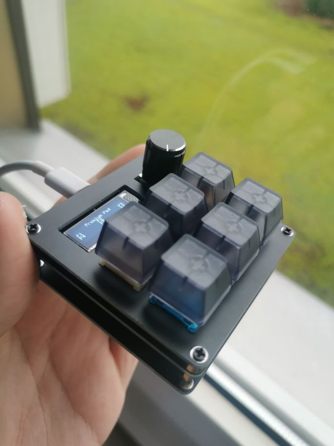
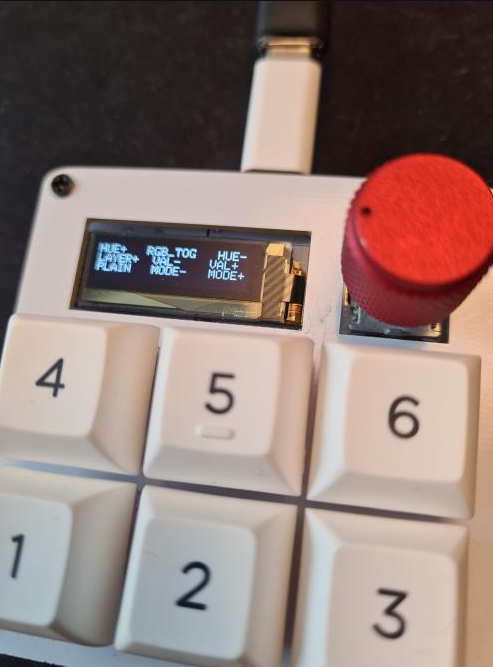
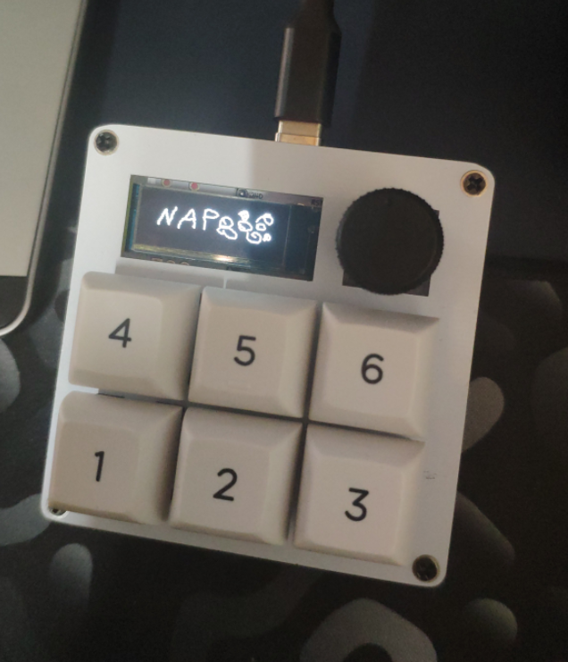
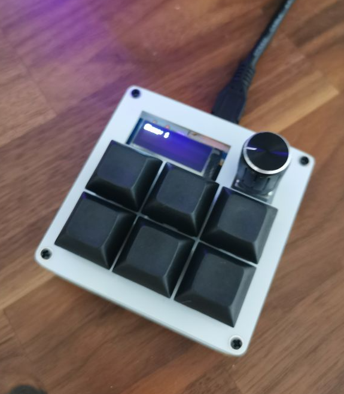
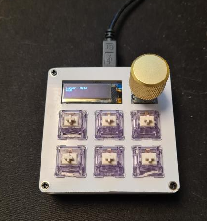

# 3x3Macropad: Affordable & Cool!

[Showcase](#showcase) | [Highlights](#highlights) | [More Infos](#more-infos)

----

This Macropad can be configurated to your needs and runs with QMK which allows you to do anything you want with it!

It not only has a stealthy look, but also features other awesome things:

* Mechanical Switches
* Encoder
* Hotswap
* USB Type C
* **OLED Display**

The coolest part of the macropad is the OLED Display on which you can display images, text and small animations (See below)

## I want one!

If you are interested in getting one yourself, leave me a message on Discord: RarePotato8DE#4824 😉

## Highlights

* 6 Mechanical Switches
* Encoder (Knob)
* Hotswap Sockets
* **OLED Screen**
* USB-C Connector
* Works with all major OSs, no driver needed.

## Showcase

Here are a few pictures of the macropad:

### ... and more!

Those are just some examples! You can basically do whatever you want!

## More Infos

[Main page](README.md)

[Build Guide](build_guide.md)

[QMK Guide](qmk.md)

## Questions?

Please feel free to message me on Discord: RarePotato8DE#4824
