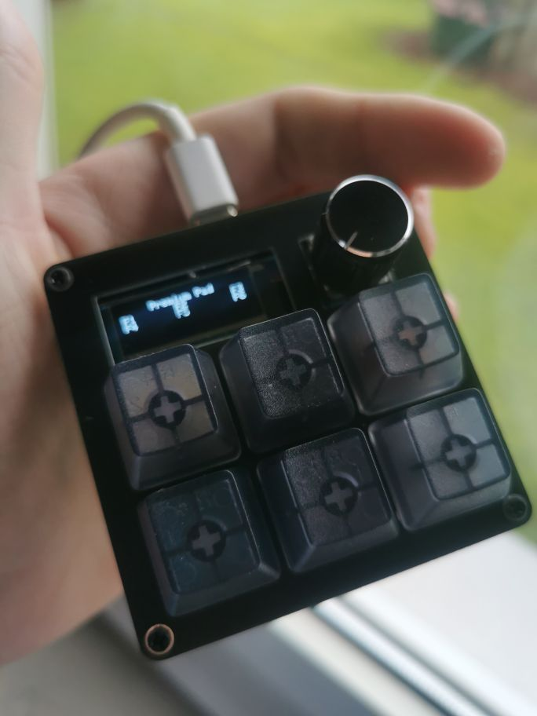

# 3x3Macropad: Affordable & Cool!

[Showcase](#showcase) | [Highlight Features](#highlights) | [More Infos](#more-infos) | [How this Project started](#how-this-project-started)

----

This Macropad can be configurated to your needs and runs with QMK which allows you to do anything you want with it!

It not only has a stealthy look, but also features other awesome things.

## Highlights

* 6 Mechanical Switches
* Encoder (Knob)
* Hotswap Sockets
* **OLED Screen**
* USB-C Connector
* Works with all major OSs, no driver needed.

The coolest part of the macropad is the OLED Display on which you can display images, text and small animations (See below)

## I want one!

If you are interested in getting one yourself, leave me a message on Discord: RarePotato8DE#4824 😉

## What's included in the Kit

* 6x Hotswap Sockets
* 1x Arduino Pro Micro
* 1x EC11 Encoder (15mm)
* 1x 0.91" OLED Display
* Bottom plate, PCB, Switch plate (all FR4 Material)
* 4x 15mm Standoffs
* 8x 6mm Screws

## Not included

* Mechanical MX Switches (6x)
* Keycaps (6x)
* Soldering Service

## Showcase

Here are a few pictures of the macropad:

### ... and more!

Those are just some examples! You can basically do whatever you want!

## How this Project started

It all started in August 2021 when I had the first contact with custom mechanical keyboards which I've seen on youtube. I was immediately interested since I've been using membrane since I had a PC - never had a mechanical keyboard. So I wanted to get myself a decent mechanical keyboard: The problem was, I wasn't sure on what to get.
So I read myself deeper into this Hobby and was especially interested in creating something myself - PCB's. And I did it!
Started off with reading ai03's PCB guide which is really good and then thought about what would be affordable to make but also nice to use.

Small keyboards (macropads) came in my mind: I've seen some in the past, but they were quite expensive and just not as cool as I would like them to be.
So I wrote down what features I would like to have: OLED, small form factor, Encoder. After that, it was time to design it.

The Layout of this Macropads actually was the first thing I had in mind and it turned out way better than expected when I got my first PCB's.
Besides that the case-less design was inspired by the custom keyboard I wanted to have at that time: Discipline65 - which I'm using now.
Not only does it look industrial and cool, but it also saves costs for a "dedicated" case.

Shortly after I build my first macropad and shared pictures of it, I noticed that there is quite a high demand for it. So I started offering them.

Now we here. 

In the past weeks I've gotten much love and appreciation from so many people who like my project. Thanks for that! 💜💜💜

## More Infos

[Main page](README.md)

[Build Guide](build_guide.md)

[QMK Guide](qmk.md)

## Questions?

Please feel free to message me on Discord: RarePotato8DE#4824
